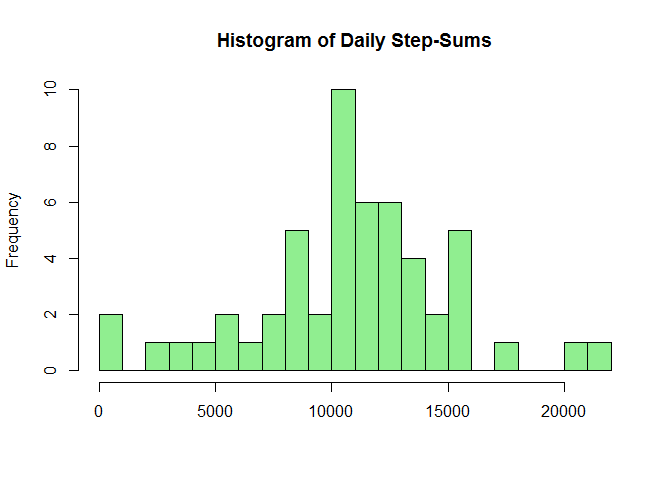
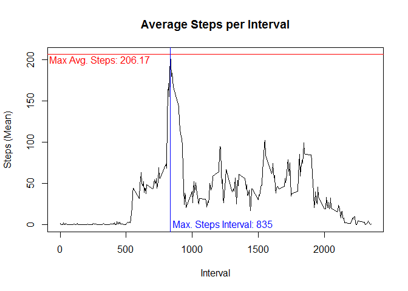
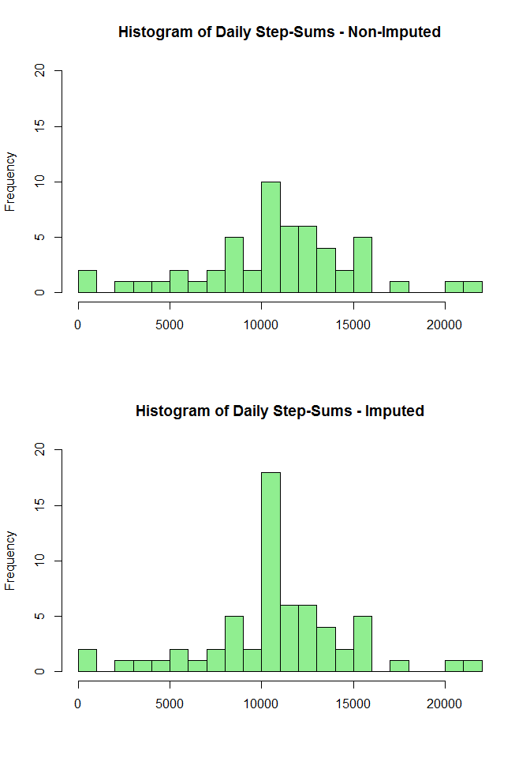
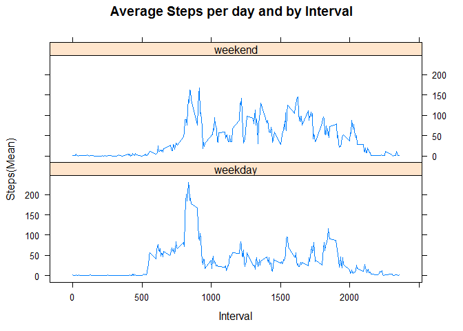

# Reproducible Research: Peer Assessment 1

## Introduction and required R packages

This is the report for course project 1 in the Coursera course *Reproducible Research*. You may require the following R packages, including dependencies to run the code and reproduce the plots:


```r
library(lattice)
```
## Loading and preprocessing the data

The following code is used to check whether any of the files exist beforehand,
load the data, unzip it, read it into R and reformat the date column:


```r
if (!file.exists('activity.zip')) {
        download.file(
                "https://d396qusza40orc.cloudfront.net/repdata%2Fdata%2Factivity.zip",
                "activity.zip",
                method = "libcurl"
        )
}
if (!file.exists('activity.csv')) {
        unzip('activity.zip')
}
allact <- read.csv("activity.csv", na.strings = "NA")
allact$date <- as.Date(allact$date)
```

## What is mean total number of steps taken per day?

### Total number of steps per day


```r
stepperday <- aggregate(steps ~ date, data = allact, sum)
head(stepperday)
```

```
##         date steps
## 1 2012-10-02   126
## 2 2012-10-03 11352
## 3 2012-10-04 12116
## 4 2012-10-05 13294
## 5 2012-10-06 15420
## 6 2012-10-07 11015
```

### Histogram of the total number of steps taken each day


```r
hist(
        stepperday$steps,
        breaks = nrow(stepperday) / 2,
        col = "light green",
        main = "Histogram of Daily Step-Sums",
        xlab = ""
)
```

<!-- -->

### Mean and median number of steps taken each day


```r
stepmean <- mean(stepperday$steps)
stepmedian <- median(stepperday$steps)
```
The values for the mean and median are:

**Mean** 
10766.19

**Median**
10765

## What is the average daily activity pattern?

### Now the times series plot with the maximum average steps and the corresponding interval


```r
stepperinterval <- aggregate(steps ~ interval, data = allact, mean)

with(
        stepperinterval,
        plot(
                interval,
                steps,
                type = "l",
                lwd = 1.5,
                main = "Average Steps per Interval",
                xlab = "Interval",
                ylab = "Steps (Mean)"
        )
)
abline(h = max(stepperinterval$steps),
       lwd = 1.5,
       col = "red")
maxstepint <-
        stepperinterval[stepperinterval$steps == max(stepperinterval$steps), 1]
abline(v = maxstepint, lwd = 1.5, col = "blue")
text(
        300,
        max(stepperinterval$steps) - 7,
        labels = paste("Max Avg. Steps:", round(max(
                stepperinterval$steps
        ), 2)),
        col = "red"
)
text(
        maxstepint + 400,
        0,
        labels = paste("Max. Steps Interval:", maxstepint),
        col = "blue"
)
```

<!-- -->

The interval that contains the maximum number of steps is **835**.

## Imputing missing values

###First, summarize all rows that contain at least one NA.


```r
rownumNA <- nrow(allact[is.na(allact), ])
```
Which is **2304** rows.

### Replace the missing values with the interval means and create a new data frame


```r
allact.impute <- merge(
        allact,
        stepperinterval,
        by.x = "interval",
        by.y = "interval",
        all.x = TRUE
)
allact.impute$steps <-
        round(with(allact.impute, ifelse(is.na(steps.x) ==
                                                 TRUE, steps.y, steps.x))
              , 2)
allact.impute <- arrange(allact.impute[, c(5, 3, 1)], date)
head(allact.impute)
```

```
##   steps       date interval
## 1  1.72 2012-10-01        0
## 2  0.34 2012-10-01        5
## 3  0.13 2012-10-01       10
## 4  0.15 2012-10-01       15
## 5  0.08 2012-10-01       20
## 6  2.09 2012-10-01       25
```

### Next create a comparison between the original histogram and the new histogram with the imputed values


```r
stepperday.imp <- aggregate(steps ~ date, data = allact.impute, sum)
head(stepperday.imp)
```

```
##         date steps
## 1 2012-10-01 10766
## 2 2012-10-02   126
## 3 2012-10-03 11352
## 4 2012-10-04 12116
## 5 2012-10-05 13294
## 6 2012-10-06 15420
```

```r
stepmean.imp <- mean(stepperday.imp$steps)
stepmedian.imp <- median(stepperday.imp$steps)

par(mfrow = c(2, 1))
hist(
        stepperday$steps,
        breaks = nrow(stepperday) / 2,
        col = "light green",
        main = "Histogram of Daily Step-Sums - Non-Imputed",
        xlab = "",
        ylim = c(0, 20)
)
hist(
        stepperday.imp$steps,
        breaks = nrow(stepperday) / 2,
        col = "light green",
        main = "Histogram of Daily Step-Sums - Imputed",
        xlab = "",
        ylim = c(0, 20)
)
```

<!-- -->


The new imputed values for the mean and median are:

**Mean** 
10766.18

**Median**
10766.13

The difference between the imputed and the non-imputed versions seems slight.
A tendency to the mean seems to occur since the distribution of values look more centered with an accentuated middle section. Apparently the variance seems to have decreased.

## Are there differences in activity patterns between weekdays and weekends?

### And finally the creation of the weekpart factor and the subsequent visualization


```r
allact.impute$weekpart <-
        factor(ifelse(
                weekdays(allact.impute$date) == "Sunday" |
                        weekdays(allact.impute$date) == "Saturday",
                "weekend",
                "weekday"
        ))
stepperinterval.imp <-
        aggregate(steps ~ interval + weekpart, data = allact.impute, mean)
xyplot(
        steps ~ interval |
                weekpart,
        data = stepperinterval.imp,
        main = "Average Steps per day and by Interval",
        xlab = "Interval",
        ylab = "Steps(Mean)",
        layout = c(1, 2),
        type = "l"
)
```

<!-- -->
